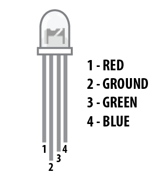

# processing-temperature

This is a proccessing program to graph data from a temperatura sensor,lm35 specificcly his state and the degrees are in celsius.

We have two important folders here : 
**Arduino-SourceCode**: This contains all the arduino code, the last code in the arduino uno board is  `sensor.ino`.

**WindowGraph**: This folder contains all the processing code, the interface is in the main module wich is named `Camilo_GraphicaRT.pde`, this file also use the other two modules `drawGraph.pde` and `serial.pde`.

All the schemes are in the **_img_** folder.

